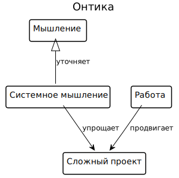

## Быстрый старт

1. Установить [Java Development Kit 12][jdk] и [SBT][sbt]
2. Если вы собираетесь использовать модели практик OMG Essence, то установить картинки [semod-plantuml][semod-plantuml]
3. Создать проект модели из шаблона [smeagol74/semod.g8][g8]
```bash
$ sbt new smeagol74/semod.g8
```

## Возможности

### Языки моделирования

#### Произвольные онтики (сущности и их связи)



[Подробнее...](ontology)

#### Системных разбиения (системы, их роли и структура)


[Подробнее...](system)

#### Практик OMG Essence (альфы, состояния, рабочие документы, практики)


[Подробнее...](essence)

#### Архитектура OpenGroup Archimate (слои, деятельности, связи)


[Подробнее...](archimate)

## Функциональные возможности

```scala
//TODO
```

[semod-plantuml]: https://github.com/smeagol74/semod-plantuml
[sbt]: https://www.scala-sbt.org/
[jdk]: https://jdk.java.net/12/
[g8]: https://github.com/smeagol74/semod.g8
